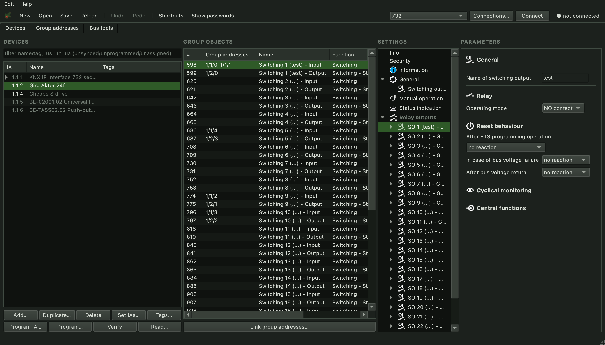

<p align="center"></p>

# Baccata

KNX project editor and commissioning tool. Import `.knxprod` product files,
edit device parameters and group addresses, download to devices over a KNX/IP
interface, and manage KNX Data Secure keys.

> **Early version.** Baccata is under active development and not suitable for
> production installations. It writes to KNX devices; a bad download can leave
> a device unprogrammed or misconfigured. Use it on test installations, keep
> ETS backups, and use it at your own risk — no warranty (see LICENSE).



## Run from source

Needs Python 3.12+ and [uv](https://docs.astral.sh/uv/).

```
uv run baccata
```

## Binaries

Packaged builds for macOS, Windows and Linux are attached to
[Releases](https://github.com/b0bs0n/baccata/releases). They are built with
[briefcase](https://briefcase.readthedocs.io/) by the GitHub workflow in
`.github/workflows/package.yml`.

## License

GPL-3.0-or-later. See [LICENSE](LICENSE).
